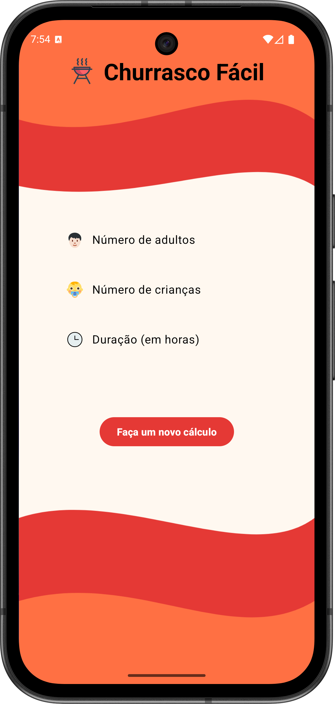
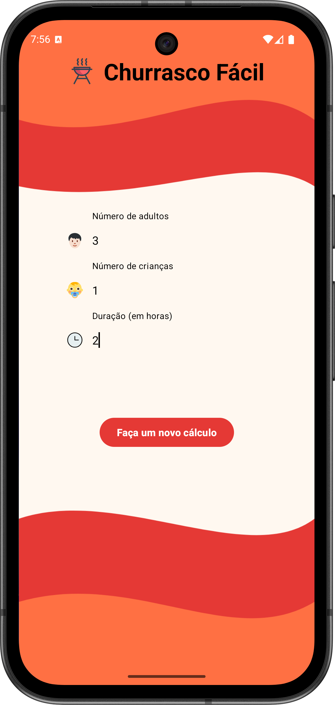
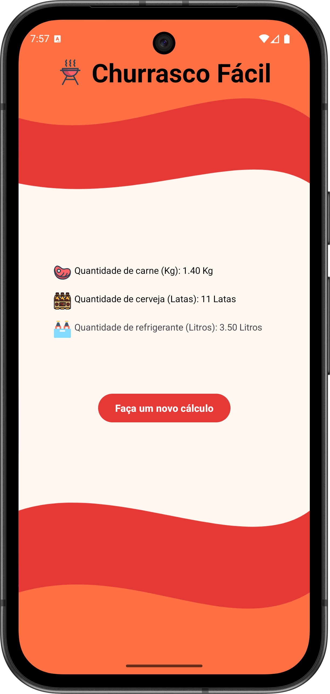

# 🔥 Easy Barbecue

**Easy Barbecue** is an Android app built with **Kotlin** that helps you plan a barbecue by estimating quantities based on the number of people and basic preferences.  
This project focuses on a clean input flow, **validation**, and generating a practical, readable result.

---

## 🧭 Overview

With Easy Barbecue you can:

- Enter the number of **people** (e.g., adults/children)
- Inform basic planning parameters (e.g., duration / style of barbecue)
- Get an **estimated shopping list** (meat and essentials) based on predefined rules
- Receive immediate feedback when inputs are invalid or incomplete

---

## ✨ Features

- ✅ Barbecue quantity estimation based on predefined rules
- ✅ Input validation (empty values, invalid numbers, edge cases)
- ✅ Clear result formatting for quick shopping decisions
- ✅ Simple, objective UI flow focused on usability

---

## ⚙️ Technologies

- **Language:** Kotlin
- **UI:** Android Views (XML)
- **Android Components:** Activities / Fragments / ViewModel *(as used in the project)*
- **Concepts Practiced:** validation, formatting, user-friendly flows, clean UI structure

---

## 🧪 Notes

- The calculations are based on **predefined estimates** (rules of thumb), not external APIs.
- The project can be extended to support:
    - Custom per-person consumption rules
    - Different meat categories and dietary options
    - Saving/exporting the shopping list (share/copy)

---

## 📸 Screenshots

## 📸 Screenshots

  